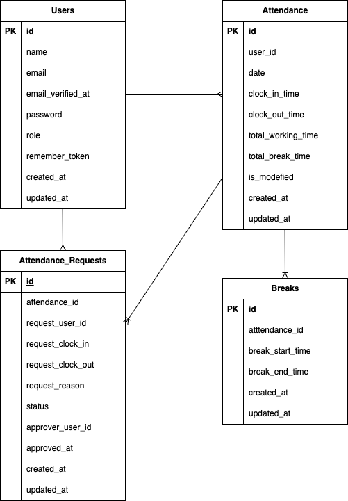

# 勤怠管理アプリ

## 環境構築
Dockerビルド
1. git clone git@github.com:k-sakata1988/mogianken_kintai_application.git
2. docker compose up -d --build

Laravel環境構築
1. docker-compose exec php bash
2. composer install
3. cp .env.example .envコマンドで.envファイルを作成し、環境変数を変更(DB_HOST,DB_DATABASE,DB_USER,DB_PASSWORD,MAIL_FROM_ADDRESSを変更)
4. php artisan key:generate
5. php artisan migrate
6. php artisan db:seed
7. php artisan test

## ER図

## ユーザー情報
管理ユーザー:
一般ユーザー:

#### 使用技術
- PHP 8.1.33
- Laravel 8.83.8
- MySQL 8.0.26
- Nginx 1.21
- Docker 28.3.2 /Docker Compose 3.8

## URL
- 開発環境: http://localhost/
- phpMyAdmin: http://localhost:8080/
- mailhog:http://127.0.0.1:8025/#